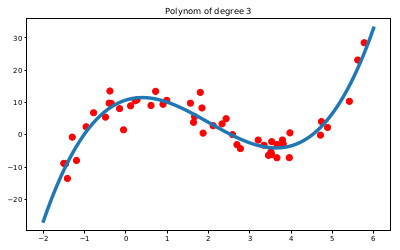
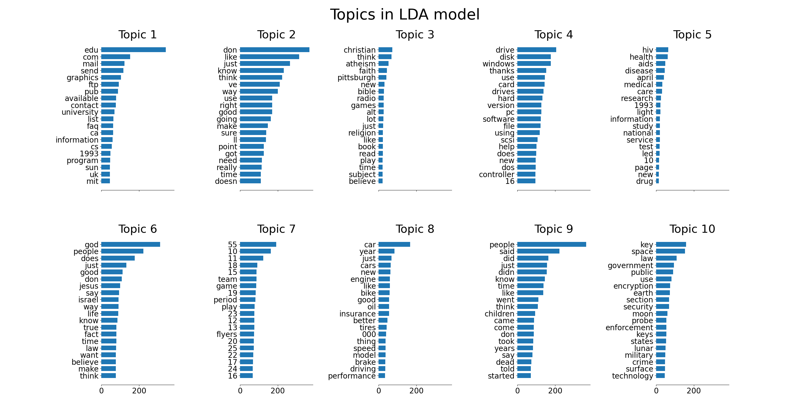

# Code for Variational Inference Class

## Regression

## Gaussian Mixture Models (GMM)

You can find the code in [gmm_em.py](gmm_em.py).

## Principal Component Analysis (PCA)

## Latent Dirichlet Allocation (LDA)

