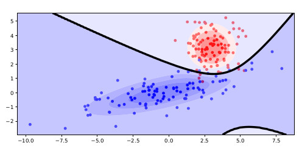
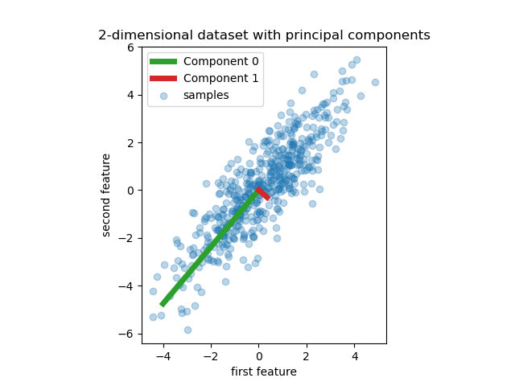

# Code for Variational Inference Class

## Regression

You can find the code in [regression.py](regression/regression.py).

## Classification / Gaussians

You can find the code in [gaussian.py](classification/gaussian.py).

## Gaussian Mixture Models (GMM)

You can find the code in [gmm_em.py](gmm/gmm_em.py).

## Principal Component Analysis (PCA)

## Latent Dirichlet Allocation (LDA)

